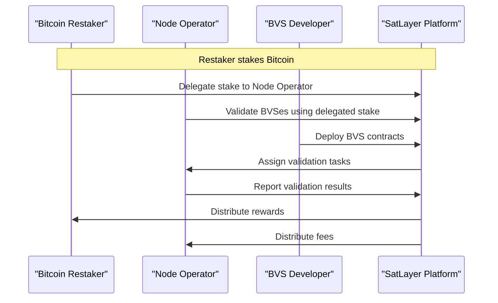

# Satlayer Demo

## Breakdown of the Diagram

1. **Restaker Stakes Bitcoin:** A Bitcoin restaker delegates their stake to a node operator through the SatLayer platform. This step is crucial as it provides the security backing for the services offered by BVS developers.

2. **Node Operator Validates BVSes:** The node operator uses the delegated stake to validate Bitcoin Validated Services (BVSes). This validation ensures that the services are secure and trustworthy.

3. **BVS Developer Deploys Contracts:** A BVS developer deploys their service contracts on the SatLayer platform. These contracts define how the service operates and interacts with users.

4. **SatLayer Assigns Validation Tasks:** The SatLayer platform assigns validation tasks to node operators based on the services they support. This ensures that each service is validated by multiple nodes, enhancing security.

5. **Node Operator Reports Validation Results:** After validating a service, the node operator reports the results back to the SatLayer platform. This feedback loop helps maintain the integrity of the services.

6. **SatLayer Distributes Rewards and Fees:** Finally, the SatLayer platform distributes rewards to restakers and fees to node operators based on their participation and performance.

## Demo Services
This demo showcases three example BVS implementations:

1. **Bitcoin-backed Storage:** Decentralized storage solution with Bitcoin's security guarantees
2. **Secure Messaging:** End-to-end encrypted messaging service with Bitcoin-level immutability
3. **Prediction Market:** Decentralized prediction markets with BTC finality